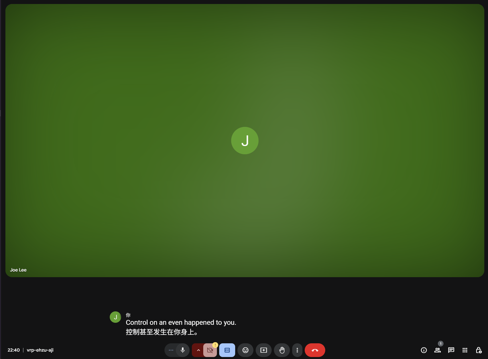

# Google Meet Caption Translator

A browser extension that translates captions in real-time during Google Meet calls.

## Features

- Real-time translation of captions in Google Meet
- Support for multiple target languages
- Configurable DeepL API key for translation

## Installation

1. Clone this repository or download the source code.
2. Run `pnpm install` or `npm install` to install dependencies.
3. Build the extension with `pnpm build` or `npm run build`.
4. Load the extension from the `build/chrome-mv3-prod` folder in your browser's extension page.

## Development

1. Clone this repository or download the source code.
2. Run `pnpm install` or `npm install` to install dependencies.
3. Start the development server with `pnpm dev` or `npm run dev`.
4. Load the extension from the `build/chrome-mv3-dev` folder in your browser's extension page.

## Usage

1. Install the extension as described above.
2. Configure your DeepL API key in the extension popup.
3. Join a Google Meet call with captions enabled.
4. The extension will automatically translate captions and display them.

## License

This project is licensed under the MIT License - see the LICENSE file for details.